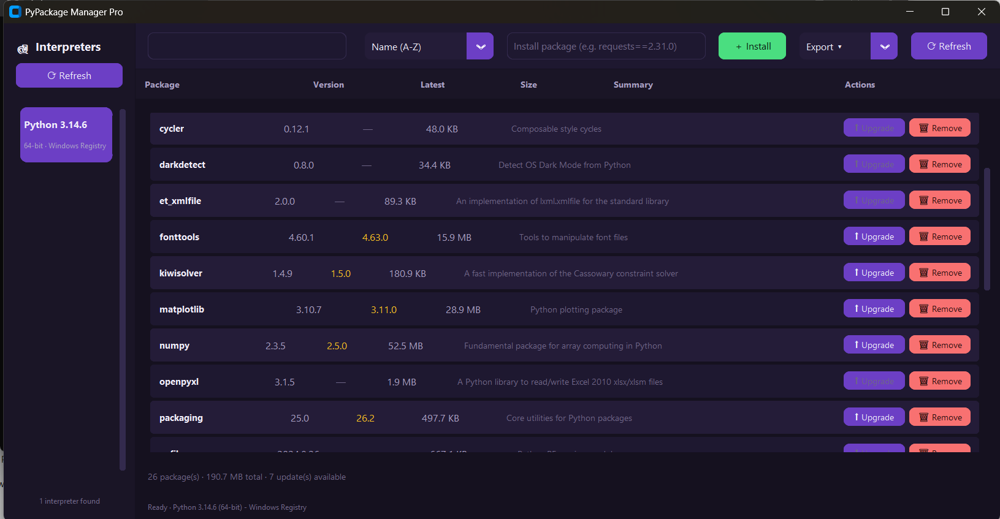

# 🐍 PyPackage Manager Pro

**A modern, dark-violet desktop GUI for managing Python packages across every interpreter installed on your Windows machine.**

Built with [CustomTkinter](https://github.com/TomSchimansky/CustomTkinter) — no more juggling `pip list`, `pip install`, and `pip uninstall` across five different Python versions from the terminal.


---

## ✨ Features

- 🐍 **Auto-detects every installed Python interpreter** — Windows Registry, `py` launcher, PATH, virtual environments, and Conda/Miniconda environments
- 📦 **Lists all installed packages** per interpreter with version, size, summary, author, and homepage
- 🔍 **Search packages** by name or description in real time
- 📅 **Sort** by name, version, or size (ascending/descending)
- 🖥️ **Modern dark-violet GUI** built with CustomTkinter, styled like VS Code / PyCharm
- ⬆️ **Detect & install updates** — flags outdated packages and upgrades them with one click
- 🗑️ **Uninstall packages** with a single click (safe, non-interactive `pip uninstall -y`)
- ➕ **Install new packages** directly from the toolbar (supports version specifiers, e.g. `requests==2.31.0`)
- 🔄 **Refresh** the package list without restarting the app
- 📄 **Export to CSV, Excel (.xlsx), or PDF** — great for audits, documentation, or sharing environment snapshots
- 🧵 **Fully responsive UI** — every pip/scan operation runs on a background thread pool, so the interface never freezes
- 📝 **Rotating log files** for troubleshooting

---

## 📸 Overview

| Area | What it does |
|---|---|
| **Sidebar (left)** | Shows every detected Python interpreter as a card. Click one to load its packages. |
| **Toolbar (top)** | Search box, sort dropdown, install field, export menu, and refresh button. |
| **Package table (center)** | Every installed package with version, latest version, size, summary, and Upgrade/Remove actions. |
| **Status bar (bottom)** | Live feedback on scans, installs, uninstalls, and exports. |

---

## 🗂️ Project Structure

# Project Structure

```text
Python-package-install-date-viewer/
├── .github/
│   └── ISSUE_TEMPLATE/
│       ├── bug_report.md
│       ├── config.yml
│       └── feature_request.md
├── .gitignore
├── CHANGELOG.md
├── CONTRIBUTING.md
├── LICENSE
├── README.md
├── assets/
│   ├── icons/
│   │   ├── app.ico
│   │   └── app.png
│   └── themes/
│       └── .gitkeep
├── build.bat
├── build.ps1
├── build.spec
├── core/
│   ├── __init__.py
│   ├── exporter.py
│   ├── models.py
│   ├── package_manager.py
│   ├── package_scanner.py
│   └── python_detector.py
├── docs/
│   └── PyPackage_Manager_Pro_Project_Report.docx
├── exports/
│   └── .gitkeep
├── gui/
│   ├── __init__.py
│   ├── app.py
│   ├── package_table.py
│   ├── sidebar.py
│   ├── theme.py
│   └── toolbar.py
├── logs/
│   └── .gitkeep
├── main.py
├── requirements.txt
├── screenshots/
│   └── main-window.png
└── utils/
    ├── __init__.py
    ├── logger.py
    └── threading_utils.py
```

## Screenshots

### Main Window




---

## 🚀 Getting Started (run from source)

**Requirements:** Windows 10/11, Python 3.10+

```bash
git clone https://github.com/<your-username>/<your-repo>.git
cd <your-repo>
pip install -r requirements.txt
python main.py
```

---

## 🏗️ Building a standalone .exe

PyPackage Manager Pro ships with a PyInstaller spec and two build scripts.

**Using PowerShell (recommended):**

```powershell
.\build.ps1
```

**Using Command Prompt:**

```cmd
build.bat
```

Both scripts will:
1. Verify Python is installed
2. Install/upgrade dependencies from `requirements.txt`
3. Clean any previous `build/`/`dist/` folders
4. Run PyInstaller using `build.spec`

The final executable will be at:

```
dist\PyPackageManagerPro\PyPackageManagerPro.exe
```

---

## 🧩 How interpreter detection works

`core/python_detector.py` runs five independent strategies and de-duplicates the results by resolved executable path:

1. **Windows Registry** — reads `HKCU`/`HKLM` → `SOFTWARE\Python\PythonCore` (and the WOW6432Node equivalent for 32-bit installs)
2. **`py` launcher** — parses `py -0p` output
3. **PATH** — scans every directory on `PATH` for `python.exe`
4. **Virtual environments** — looks for `pyvenv.cfg` in common project folders
5. **Conda/Miniconda** — parses `conda env list`

Each candidate interpreter is "probed" by briefly running it with `-c` to confirm its version and architecture before being added to the list, so stale registry entries never show up as usable interpreters.

---

## 🛠️ Tech Stack

- **Python 3.10+**
- **[CustomTkinter](https://github.com/TomSchimansky/CustomTkinter)** — modern GUI widgets
- **importlib.metadata** — package introspection
- **subprocess + ThreadPoolExecutor** — safe, non-blocking pip operations
- **openpyxl** — Excel export
- **reportlab** — PDF export
- **PyInstaller** — standalone Windows executable packaging

---

## 🚀 Future Features

- Export to Excel (.xlsx)
- Export to PDF
- Package uninstall
- Detect multiple Python installations
- Display package size
- Dark/Light mode
- Automatic update checker
- Package dependency viewer
- Package information panel
- Package update checker
---

## 📄 License

This project is licensed under the GNU General Public License v2.0 (GPL-2.0). See the LICENSE file for details.

---

## 🙋 Contributing

Issues and pull requests are welcome. If you find an interpreter that isn't being detected correctly on your machine, please open an issue with your Python install method (python.org installer, Microsoft Store, Conda, etc.) so detection can be improved.
